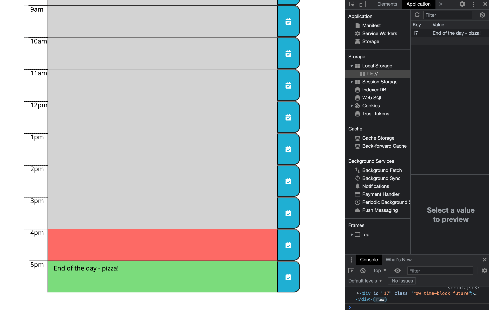
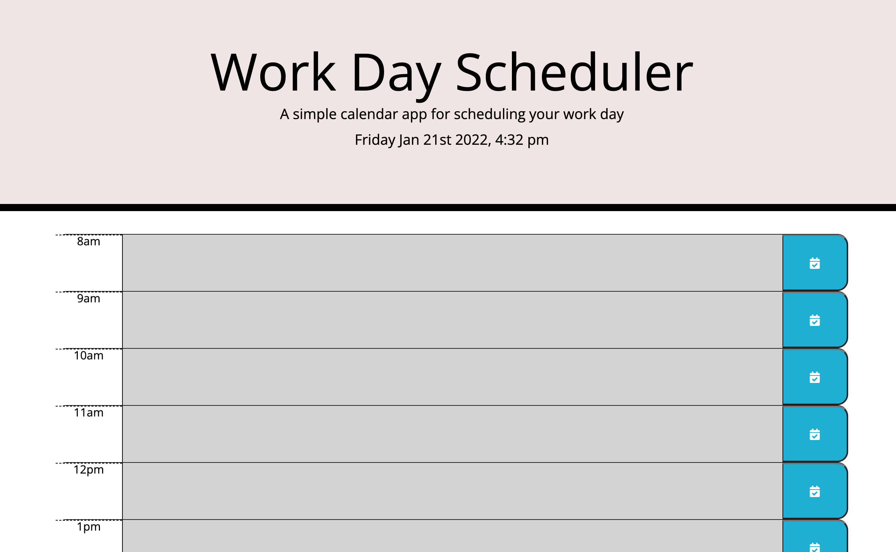
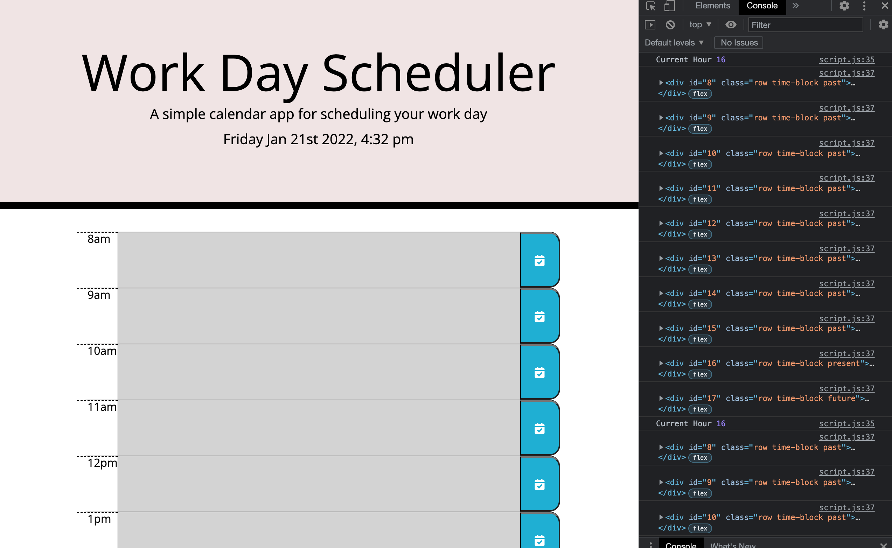

# Work-Day-Scheduler

User Story
AS AN employee with a busy schedule
I WANT to add important events to a daily planner
SO THAT I can manage my time effectively.

A neat planner that fully meets the needs of a busy employee!

Acceptance Criteria
GIVEN I am using a daily planner to create a schedule
WHEN I open the planner
THEN the current day is displayed at the top of the calendar.

This was created using moments. I looked for the correct format to display the current day, date and time.

WHEN I scroll down
THEN I am presented with timeblocks for standard business hours.

I created the time block rows in HTML and added a button for each one. The first column in the row was used to assign a time. Standard business hours have been based on 9am - 5pm

WHEN I view the timeblocks for that day
THEN each timeblock is color coded to indicate whether it is in the past, present, or future.

Achieved using this and moments. I ran an if, else statement and asked this to check the time of each time-block and assign a colour to it from the CSS, based on whether it was in the past, present or future. 

WHEN I click into a timeblock
THEN I can enter an event.

I called the save button class using jquery and added a click. I then created a function targeting the siblings of the save button, to allow the user to input text. The next step was to get it saved properly.

WHEN I click the save button for that timeblock
THEN the text for that event is saved in local storage
WHEN I refresh the page
THEN the saved events persist.

This has been achieved using local storage. I used set item and get item within javascript and matched it with the id's in HTML. The set item saved the text to the page, but was disappearing on refresh. I had to try it a few times before I got it working correctly - I was missing get item and had to list each 'get' individually according to the id's.

Application created using Javascript, HTML and CSS

Link to github live site: https://misscbrown.github.io/Work-Day-Scheduler/Develop/

Contact: djmisscbrown@hotmail.com

